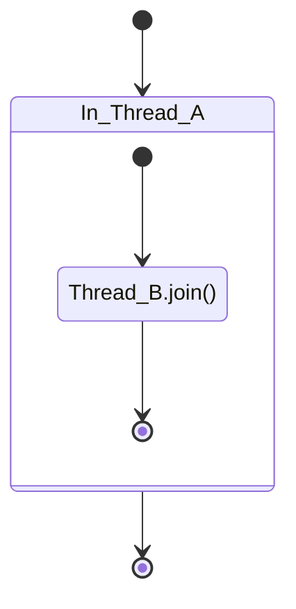

# 一、基本概念
## 1.1 程序、进程与线程

- **程序（program）**：为完成特定任务，用某种语言编写的一组指令的集合。即指一段静态的代码，静态对象。
- **进程（process）**：程序的一次执行过程，或是正在内存中运行的应用程序。如：运行中的QQ，运行中的网易音乐播放器。
- **线程（thread）**：进程可进一步细化为线程，是程序内部的一条执行路径。一个进程中至少有一个线程。
## 1.2 线程调度

- **分时调度**：所有线程轮流使用 CPU 的使用权，并且平均分配每个线程占用 CPU 的时间。
- **抢占式调度**：优先级高的线程以较大概率优先使用CPU。如果线程的优先级相同，则会随机选择一个线程执行（即，线程的随机性），Java使用此种方式调度。
## 1.3 并行与并发

- **并行（parallel）**：同一时刻，多件事情同时发生，即同一时刻，有多条指令同时在多个CPU上同时执行。


- **并发（concurrency）**：同一时段内，有多件事情发生，即在一段时间内，有多条指令在单个CPU上快速轮换、交替执行，使得在宏观上具有多个进程同时执行的效果。


# 二、线程的创建与启动

## 2.1 继承Thread类（方式1）

```java
class ThreadDemo extends Thread {
    // 线程示例，打印100以内的偶数
    @Override
    public void run(){
    // 重写run()，在run()中定义线程运行的任务，此处是打印100以内的偶数
        for (int i = 0; i <= 100; i += 2) {
            System.out.println(Thread.currentThread().getName() + ": " + i);
        }
    }
}

public class MainDemo {
    public static void main(String[] args){
        ThreadDemo t1 = new ThreadDemo();
        // 要用start()方法启动线程,
        // 而不是t1.run(),
        // 否则t1.run()将会被在main线程中运行，
        // 而非在子线程t1中运行,就不是真正意义上的“多”线程了
        t1.start()
    }
}
```

## 2.2 实现Runnable接口（方式2）

```java
class RunnableDemo implements Runnable {
    // 线程示例，打印100以内的偶数
    @Override
    public void run(){
    // 重写run()，在run()中定义线程运行的任务，此处是打印100以内的偶数
        for (int i = 0; i <= 100; i += 2) {
            System.out.println(Thread.currentThread().getName() + ": " + i);
        }
    }
}

public class MainDemo {
    public static void main(String[] args){
        RunnableDemo r1 = new RunnableDemo();
        // 需将创建的Runnable实例传入Thread实例中，
        // 即，Runnable中的run()的真正执行者还是Thread类的对象
        Thread t1 = new Thread(r1);
        // 启动线程
        t1.start()
    }
}
```

## 2.3 Thread与Runnable比较

### 2.3.1 区别

- **Thread**：线程代码存放在Thread子类的run()方法中。
- **Runnbale**：线程代码存放在Runnable实现子类的run()方法中。
### 2.3.2 Runnable的优势

- 避免了单继承的局限性（**多继承**）；
- 多个线程可以共享同一个接口实现类的对象，非常适合多个相同线程来处理同一份资源（**可共享**）;
- 增加程序的健壮性，实现解耦操作，代码可以被多个线程共享，代码和线程独立（**耦合度低**）

# 三、Thread的常用结构及方法

## 3.1 构造器

- `public Thread()`：创建线程对象。
- `public Thread(String name)`：创建具名线程对象。
- `public Thread(Runnable target)`：创建指定了目标对象（Runnable）的线程对象。
- `public Thread(Runnable target, String name)`：创建指定了目标对象（Runnable）的具名线程对象。

## 3.2 常用方法系列1

- `public void run()`：定义线程待执行的任务。
- `public void start()`：启动线程，使JVM虚拟机启动子线程运行run()的任务，只能调用一次，否则会报`IllegalThreadStateException`异常。
- `public void setName(String name)`：为线程命名。
- `public String getName()`：获取线程名。
- `public static Thread currentThread()`：返回对当前正在执行的线程对象的引用。
- `public static void sleep(long mills)`：使其所在的线程暂停指定的毫秒数。注意，不是谁调用暂停谁（因为是static方法），而是在谁中调用就暂停谁；另外，此方法暂停线程时，不会释放其所在线程获取的锁。
- `public static void yield()`：yield()只是让当前线程暂停一下，让系统的线程调度器重新调度一次，希望优先级与当前线程相同或更高的其他线程能够获得执行机会，但是这个不能保证，完全有可能的情况是，当某个线程调用了yield方法暂停之后，线程调度器又将其调度出来重新执行。

## 3.3 常用方法系列2

- `public final boolean isAlive()`：判断线程是否为活跃状态（即线程已启动且未终止），是则返回 `true`。
- `public final void join()`：等待该线程终止。如下图，则Thread_A会等Thread_B执行完才会继续执行


- `public final void join(long millis)`：等待该线程终止的时间最长为 millis 毫秒。如果millis时间到，将不再等待。
- `public final void join(long millis, int nanos)`：等待该线程终止的时间最长为 millis 毫秒 + nanos 纳秒。
- `public final void stop()`：使线程立刻强行终止并释放所有已获取的锁，可能会出现数据安全问题，已过时。
- `void suspend()/void resume()`： 这两个操作就好比播放器的暂停和恢复。二者必须成对出现，否则非常容易发生死锁。suspend()调用会导致线程暂停，但不会释放任何锁资源，导致其它线程都无法访问被它占用的锁，直到调用resume()。已过时，不建议使用。

## 3.4 线程的优先级

优先级高的线程优先执行（被执行的几率更大），Thread类常见的三个优先级常量：
- `MAX_PRIORITY(10)`：最高优先级。
- `MIN_PRIORITY(1)`：最低优先级。
- `NORM_PRIORITY(5)`：普通优先级（线程默认级）。

与之相关的方法如下：
- `public final int getPriority()`：获取线程优先级。
- `public final void setPriority(int newPriority)`：设置线程优先级，范围是[1, 10]之间。

## 3.5 守护进程

有一种线程，它是在后台运行的，它的任务是为其他线程提供服务的，这种线程被称为“守护线程”。JVM的垃圾回收线程就是典型的守护线程。

守护线程有个特点，就是如果所有非守护线程都死亡，那么守护线程自动死亡。形象理解：兔死狗烹，鸟尽弓藏

调用setDaemon(true)方法可将指定线程设置为守护线程。必须在线程启动之前设置，否则会报IllegalThreadStateException异常。

调用isDaemon()可以判断线程是否是守护线程。

# 四、线程的生命周期

## 4.1 JDK 1.5之前：5种状态

五种状态：新建（New）、就绪（Runnable）、运行（Running）、阻塞（Blocked）、死亡（Dead）


## 4.2 JDK1.5 及之后：6种状态

在`java.lang.Thread.State`的枚举类中这样定义：
```java
public enum State {  
    NEW,  
    RUNNABLE,  
    BLOCKED,  
    WAITING,  
    TIMED_WAITING,  
    TERMINATED;  
}
```


# 五、线程安全

## 5.1 概念

当多个线程对同一资源对象进行写操作时，该被写对象的结果可能会出现不一致的问题。如一百个线程同时对同一变量执行加一操作，其和可能会小于100，CPU性能越好，其和就会越小，这种类似现象即为线程不安全；若采取一定的措施，使这100个线程的和为100，此时称为是线程安全的。为保证线程安全，常采用的是同步关键字`synchronized`和锁对象`Lock`类的实例

## 5.2 synchronized关键字

### 5.2.1 同步代码块和同步方法

**同步代码块**：synchronized 关键字可以用于某个区块前面，表示只对这个区块的资源实行互斥访问。格式：
```java
synchronized (同步锁) {
    可能产生线程安全问题的代码
}
```
**同步方法**：synchronized 关键字直接修饰方法，表示同一时刻只有一个线程能进入这个方法，其他线程在外面等着。
```java
public synchronized void method(){
    可能产生线程安全问题的代码
}
```

### 5.2.2 示例

场景：两个人（两个线程）一起卖100张票（资源：100张票）
#### 5.2.2.1 同步代码块（以实例作为同步锁）
以实例对象作为同步锁，此时此作为同步锁的对象在整个代码中必须唯一，如下面的代码中，锁对象为Ticket类的实例`tr1`，`tr1`在`main()`中唯一，被多个线程（t1和t2）执行。

```java
public class SaleTicket{
    public static void main(String[] args){
        // tr1对象是唯一的
        Ticket tr1 = new Ticket();
        Thread t1 = new Thread(tr1);
        Thread t2 = new Thread(tr1);

        t1.start();
        t2.start();
    }
}

class Ticket implements Runnable{
    private int tickets = 100;

    @Override
    public void run(){

        while (true) {
            synchronized (this) {// 以Runnable实例作为同步锁
            // 卖票逻辑--可能会产生线程安全问题的操作（卖票）
                try {
                    // 加入延时，使线程安全问题更加明显
                    Thread.sleep(5);
                } catch (InterruptedException e) {
                    e.printStackTrace();
            }

            // 卖票
            if (tickets > 0){
                System.out.println(Thread.currentThread().getName() + "卖出票，票号为：" + tickets);
                tickets--;
            } else {
                break;
            }
        }
    }
}
```

#### 5.2.2.1 同步代码块（以类作为同步锁）
以类作为同步锁：以类作为同步锁，此时此作为同步锁的类在整个代码中必须唯一，如下面的代码中，锁对象为Ticket类，尽管有两个Ticket类的实例`t1`和`t2`，但`main()`中只有一个类Ticket，保证了同步锁（Ticket.class）的唯一。

```java
public class SaleTicket{
    public static void main(String[] args){
        Ticket t1 = new Ticket();
        Ticket t2 = new Ticket();

        t1.start();
        t2.start();
    }
}

class Ticket extends Thread{
    private static int tickets = 100;

    @Override
    public void run(){

        while (true) {

            synchronized (Ticket.class) { // 以Thread子类Ticket作为同步锁
            // 卖票逻辑--可能会产生线程安全问题的操作（卖票）
                try {
                    // 加入延时，使线程安全问题更加明显
                    Thread.sleep(5);
                } catch (InterruptedException e) {
                    e.printStackTrace();
            }

            // 卖票
            if (tickets > 0){
                System.out.println(Thread.currentThread().getName() + "卖出票，票号为：" + tickets);
                tickets--;
            } else {
                break;
            }
        }
    }
}

```

#### 5.2.2.3 非静态同步方法

此种方式和 5.2.2.1 同步代码块（以实例作为同步锁）本质上是一样的，只是写法不同（即把原同步代码块中的代码封装到一个方法中并以`synchronized`修饰），以下是示例代码：

```java
public class SaleTicket{
    public static void main(String[] args){
        // tr1对象是唯一的
        Ticket tr1 = new Ticket();
        Thread t1 = new Thread(tr1);
        Thread t2 = new Thread(tr1);

        t1.start();
        t2.start();
    }
}

class Ticket implements Runnable{
    private int tickets = 100;

    @Override
    public void run(){

        while (tickets > 0) {
            saleTicket(); 
        }
    }

    public synchronized void saleTicket(){ // 以Runnable实例作为同步锁
        try {
            // 加入延时，使线程安全问题更加明显
            Thread.sleep(5);
        } catch (InterruptedException e) {
            e.printStackTrace();
        }

        // 卖票
        if (tickets > 0){
            System.out.println(Thread.currentThread().getName() + "卖出票，票号为：" + tickets);
            tickets--;
        } 
    }
    
}
```

#### 5.2.2.4 静态同步方法

此种方式和 5.2.2.2 同步代码块（以类作为同步锁）本质上是一样的，只是写法不同，以下是示例代码：

```java
public class SaleTicket{
    public static void main(String[] args){
        // tr1对象是唯一的
        Thread t1 = new Thread();
        Thread t2 = new Thread();

        t1.start();
        t2.start();
    }
}

class Ticket extends Thread{
    private static int tickets = 100;

    @Override
    public void run(){

        while (tickets > 0) {
            saleTicket(); 
        }
    }

    public synchronized static void saleTicket(){ // 以Thread子类Ticket作为同步锁
        try {
            // 加入延时，使线程安全问题更加明显
            Thread.sleep(5);
        } catch (InterruptedException e) {
            e.printStackTrace();
        }

        // 卖票
        if (tickets > 0){
            System.out.println(Thread.currentThread().getName() + "卖出票，票号为：" + tickets);
            tickets--;
        } 
    }
    
}
```

## 5.3 同步操作的思考顺序

### 5.3.1 如何找问题（非常重要）

即代码是否存在线程安全：
（1）明确哪些代码是多线程运行的代码。
（2）明确多个线程是否有共享数据。
（3）明确多线程运行代码中是否有多条语句操作共享数据。

### 5.3.2 如何解决（非常重要）

对多条操作共享数据的语句，只能让一个线程都执行完，在执行过程中，其他线程不可以参与执行。 即所有操作共享数据的这些语句都要放在同步范围中。

注意：
- 范围太小：不能解决安全问题;
- 范围太大：因为一旦某个线程抢到锁，其他线程就只能等待，所以范围太大，效率会降低，不能合理利用CPU资源。
## 5.4 单例模式的线程安全问题

### 5.4.1 饿汉式（无线程安全问题）

即在类初始化时就直接创建单例对象，而类初始化过程是没有线程安全问题的。
- 形式一：
```java
public class HungrySingle{
    private static HungrySingle INSTANCE = new HungrySingle();
    private HungrySingle(){}

    public static HungrySingle getInstance(){
        return INSTANCE;
    }
}
```

- 形式二：
```java
public enum HungrySingle{
    INSTANCE;
}
```

### 5.4.2 懒汉式（有线程问题）

延迟创建对象，第一次调用`getInstance`方法再创建对象。完全有可能的情况是，多个线程同时调用`getInstance()`，使得其结果（引用对象）不一致。

- 形式一（静态同步方法）：
```java
public class LazySingle{
    private static LazySingle instance;
    private LazySingle(){}

    public static synchronized LazySingle getInstance(){
        if (instance == null){
            instance = new LazySingle();
        }
        return instance;
    }
}
```

- 形式二（同步代码块）：
```java
public class LazySingle{
    private static LazySingle instance;
    private LazySingle(){}

    public static LazySingle getInstance(){
        synchronized (LazySingle.class) {
            if (instance == null){
                instance = new LazySingle();
            }
        }
        return instance;
    }
}
```

- 形式三（是形式二的优化）：
```java
public class LazySingle{
    // volatile避免instance = new LazySingle();过程中的指令重排问题
    private static volatile LazySingle instance = null;
    private LazySingle(){}

    public static LazySingle getInstance(){
        if (instance == null){
            synchronized (LazySingle.class) {
                if (instance == null){
                    instance = new LazySingle();
                }
            }
        }
        return instance;
    }
}
```

- 形式四：使用内部类
内部类只有在外部类被调用才加载，产生INSTANCE实例；又不用加锁,此模式具有之前两个模式的优点，同时屏蔽了它们的缺点，是最好的单例模式。
```java
public class LazySingle{
    private LazySingle(){}

    public static LazySingle getInstance(){
        return Inner.INSTANCE;
    }

    private static class Inner{
        static final LazySingle INSTANCE = new LazySingle();
    }
}
```

# 六、死锁

## 6.1 示例

不同的线程分别占用对方需要的同步资源不放弃，都在等待对方放弃自己需要的同步资源，就形成了线程的死锁。

示例：
```java
public class DeadLock {
    public static void main(String[] args) {
        StringBuilder s1 = new StringBuilder();
        StringBuilder s2 = new StringBuilder();

        new Thread(){
            @Override
            public void run(){
                synchronized (s1){
                    s1.append('a');
                    s2.append('1');
                    try {
                        Thread.sleep(10);
                    } catch (InterruptedException e) {
                        e.printStackTrace();
                    }

                    synchronized (s2){
                        s1.append('b');
                        s2.append('2');
                        System.out.println(s1);
                        System.out.println(s2);
                    }
                }
            }
        }.start();

        new Thread(){
            @Override
            public void run(){
                synchronized (s2){
                    s1.append('c');
                    s2.append('3');
                    try {
                        Thread.sleep(10);
                    } catch (InterruptedException e) {
                        e.printStackTrace();
                    }
                    synchronized (s1){
                        s1.append('d');
                        s2.append('4');
                        System.out.println(s1);
                        System.out.println(s2);
                    }
                }
            }
        }.start();
    }
}
```


从上图的结果可知（没打印s1和s2），程序已处于死锁状态。

## 6.2 死锁的诱因及解决思路

### 6.2.1 诱因

1. 互斥条件
2. 占用且等待
3. 不可抢夺（或不可抢占）
4. 循环等待
> 以上四个条件，同时出发便会死锁。

### 6.3.2 解决思路

死锁一旦出现，基本很难人为干预，只能尽量规避。可以考虑打破上面的诱发条件。

- 针对条件1：互斥条件基本上无法被破坏。因为线程需要通过互斥解决安全问题。
- 针对条件2：可以考虑一次性申请所有所需的资源，这样就不存在等待的问题。
- 针对条件3：占用部分资源的线程在进一步申请其他资源时，如果申请不到，就主动释放掉已经占用的资源。
- 针对条件4：可以将资源改为线性顺序。申请资源时，先申请序号较小的，这样避免循环等待问题。

## 6.3 JDK5新特性：Lock(显式锁)  

- JDK5.0的新增功能，保证线程的安全。与采用`synchronized`相比，Lock可提供多种锁方案，更灵活、更强大。Lock通过显式定义同步锁对象来实现同步。同步锁使用Lock对象充当。  
- `java.util.concurrent.locks.Lock`接口是控制多个线程对共享资源进行访问的工具。锁提供了对共享资源的独占访问，每次只能有一个线程对Lock对象加锁，线程开始访问共享资源之前应先获得Lock对象。  
- 在实现线程安全的控制中，比较常用的是*ReentrantLock*，可以显式加锁、释放锁。  
  
> ReentrantLock类实现了 Lock 接口，它拥有与 synchronized 相同的并发性和内存语义，但是添加了类似锁投票、定时锁等候和可中断锁等候的一些特性。此外，它还提供了在激烈争用情况下更佳的性能。  
  
- Lock锁也称同步锁，加锁与释放锁方法。  
  
> `public void lock()` :加同步锁  
>  
> `public void unlock()` :释放同步锁  
  
代码结构：  
  
```java  
class LockDemo{  
    //1. 创建Lock的实例，必须确保多个线程共享同一个Lock实例  
    private final ReentrantLock lock = new ReentrantLock();  
      
    public void method(){  
        try {  
            //2. 调动lock()，实现需共享的代码的锁定  
                lock.lock();  
              
            // 保证线程安全的代码  
        } finally {  
            //3. 调用unlock()，释放共享代码的锁定  
            lock.unlock();  
        }  
    }  
}  
```  
  
举例：  
  
```java  
import java.util.concurrent.locks.ReentrantLock;  
  
public class ExplicitLockDemo {  
    public static void main(String[] args) {  
        Window w = new Window();  
        Thread t1 = new Thread(w, "窗口A");  
        Thread t2 = new Thread(w, "窗口B");  
  
        t1.start();  
        t2.start();  
    }  
}  
  
class Window implements Runnable{  
    private int ticket = 100;  
    private final ReentrantLock lock = new ReentrantLock();  
  
    @Override  
    public void run(){  
        while (true) {  
            try {  
                lock.lock();  
  
                try {  
                    Thread.sleep(10);  
                } catch (InterruptedException  e) {  
                    e.printStackTrace();  
                }  
  
                if (ticket > 0) {  
                    System.out.println(Thread.currentThread().getName() + "卖出票号：" + ticket--);  
                } else {  
                    break;  
                }  
            }  
            finally {  
                lock.unlock();  
            }  
              
        }  
    }  
}  
  
```  
  
# 七、 线程间的通信  
  
## 7.1 简介  
  
线程间对同一资源的写操作造成了资源竞争，易引发线程安全问题；但线程间也会有协作，如线程A生成某资源、线程B消费某资源，即生产者-消费者模型，线程通信是通过 `wait()-notify()/notifyAll()`实现的。  
  
> `wait()/wait(time)`，立即释放所持有的同步锁和资源，并不再参与CPU的调度，直到被其他线程`notify()/notifyAll()`，被通知的线程被唤醒后也不一定能立即恢复执行，因为它当初中断的地方是在同步块内，而此刻它已经不持有锁，所以它需要再次尝试去获取锁（很可能面临其它线程的竞争），成功后才能在当初调用 wait 方法之后的地方恢复执行。  
  
总结如下： 
- 如果能获取锁，线程就从 WAITING 状态变成 RUNNABLE（可运行） 状态；  
- 否则，线程就从 WAITING 状态又变成 BLOCKED（等待锁） 状态。  
  
## 7.2 调用wait和notify需注意的细节  
  
- wait方法与notify方法必须要由*同一个锁对象调用*。因为：对应的锁对象可以通过notify唤醒使用同一个锁对象调用的wait方法后的线程。  
- wait方法与notify方法是属于Object类的方法的。因为：锁对象可以是任意对象，而任意对象的所属类都是继承了Object类的。  
- wait方法与notify方法必须要在*同步代码块*或者是*同步函数*中使用。因为：必须要*通过锁对象*调用这2个方法。否则会报`java.lang.IllegalMonitorStateException`异常。

## 7.3 生产者-消费者示例

 生产者(Productor)将产品交给店员(Clerk)，而消费者(Customer)从店员处取走产品，店员一次只能持有固定数量的产品（比如:20），如果生产者试图生产更多的产品，店员会叫生产者停一下，如果店中有空位放产品了再通知生产者继续生产；如果店中没有产品了，店员会告诉消费者等一下，如果店中有产品了再通知消费者来取走产品。

```java
public class ProducerCustomer {
    public static void main(String[] args) {
        Clerk clerk = new Clerk();
        Productor productor = new Productor(clerk);
        Customer customerA = new Customer(clerk);
        Customer customerB = new Customer(clerk);

        productor.setName("生产者");
        customerA.setName("消费者 A");
        customerB.setName("消费者 B"); 

        productor.start();
        customerA.start();
        customerB.start();
    }
}

  
class Clerk{
    private int productNum = 0;
    public synchronized void addProduct(){
        if (productNum < 20) {
            productNum++;
            System.out.println(Thread.currentThread().getName() + "生产了第" + productNum + "个产品");
            notifyAll(); //生产一次就唤醒一次消费者
        } else {
            try {
                wait();
            } catch (InterruptedException e) {
                e.printStackTrace();
            }
        }
    }
  
    public synchronized void subProduct(){
        if (productNum > 0) {
            System.out.println(Thread.currentThread().getName() + "消费了第" + productNum + "个产品");
            productNum--;
            notifyAll(); // 消费一个就唤醒一次生产者
        } else {
            try {
                wait();
            } catch (InterruptedException e) {
                e.printStackTrace();
            }
        }
    }
}


class Productor extends Thread{
    private Clerk clerk;
    Productor(Clerk clerk){
        this.clerk = clerk;
    }
    @Override
    public void run(){
        while (true) {
            try {
                Thread.sleep(50); // 延时操作应放在run()中，模拟线程实际业务的耗时操作
            } catch (InterruptedException e){
                e.printStackTrace();
            }
            clerk.addProduct();
        }
    }
}

  

class Customer extends Thread{
    private Clerk clerk;
    Customer(Clerk clerk){
        this.clerk = clerk;
    }
    
    @Override
    public void run(){
        while (true) {
            try {
                Thread.sleep(100);
            } catch (InterruptedException e){
                e.printStackTrace();
            }
            clerk.subProduct();
        }
    }
}
```

运行结果如下：


## 7.4 sleep()和wait()的对比

- 相同点：一旦执行，都会使得当前线程结束执行状态，进入阻塞状态。
- 不同点：
> ① 定义方法所属的类：sleep():Thread中定义。 wait():Object中定义。
> ② 使用范围的不同：sleep()可以在任何需要使用的位置被调用； wait():必须使用在同步代码块或同步方法中。
> ③ 都在同步结构中使用的时候，是否释放同步监视器的操作不同：sleep():不会释放同步监视器 ;wait():会释放同步监视器。
> ④ 结束等待的方式不同：sleep()：指定时间一到就结束阻塞。 wait():可以指定时间也可以无限等待直到notify或notifyAll。

## 7.5 同步锁的释放

### 7.5.1 会释放锁的情况

1. 当前线程的同步方法、同步代码块执行结束。
2. 当前线程在同步代码块、同步方法中遇到break、return终止了该代码块、该方法的继续执行。
3. 当前线程在同步代码块、同步方法中出现了未处理的Error或Exception，导致当前线程异常结束。
4. 当前线程在同步代码块、同步方法中执行了锁对象的wait()方法，当前线程被挂起，并释放锁。

### 7.5.2 不会释放锁的情况

1. 线程执行同步代码块或同步方法时，程序调用Thread.sleep()、Thread.yield()方法暂停当前线程的执行。
2. 线程执行同步代码块时，其他线程调用了该线程的suspend()方法将该该线程挂起，该线程不会释放锁（同步监视器）。
> 应尽量避免使用suspend()和resume()这样的过时来控制线程。

# 八、JDK5新增的线程创建方式（了解即可）

## 8.1 实现Callable接口

简单记忆，Callable即有返回值的`Runnable`。

代码示例如下：
```java
import java.util.concurrent.Callable;
import java.util.concurrent.ExecutionException;
import java.util.concurrent.FutureTask;


public class CallableDemo {
    public static void main(String[] args) {
        NumCallable numCallable = new NumCallable();
        FutureTask<Integer> futureTask = new FutureTask<Integer>(numCallable);
        new Thread(futureTask).start();
        try {
            int sum = futureTask.get();// 在NumCallable中的call()执行完之前，System.out.println("总和为：" + sum);会一直阻塞
            System.out.println("总和为：" + sum);
        } catch (InterruptedException e){
            e.printStackTrace();
        } catch (ExecutionException e) {
            e.printStackTrace();
        }
    }
}


class NumCallable implements Callable<Integer>{
    @Override
    public Integer call() throws Exception{
        int sum = 0;
        for (int i = 1; i <= 100; i++) {
            if (i % 2 == 0) {
                System.out.println(i);
                sum += i;
            }
        }
        return sum;
    }
}
```

## 8.2 线程池

在需要频繁创建多个执行短（短指时间）任务的线程的情况下，频繁地创建销毁线程（建/毁线程耗时间和系统资源）会降低系统的效率，此时，适合使用线程池，即线程执行完任务后，不会销毁，而是存入“池”中，以待之后运行，节省了建/毁线程耗时间和系统资源。以下是线程池的简单使用：

```java
import java.util.concurrent.ExecutorService;
import java.util.concurrent.Executors;
import java.util.concurrent.Future;
import java.util.concurrent.ThreadPoolExecutor;


public class ThreadPoolDemo {
    public static void main(String[] args) {
        ExecutorService service = Executors.newFixedThreadPool(10);
        ThreadPoolExecutor service1 = (ThreadPoolExecutor) service;
        // 设置线程池中线程数的上限
        service1.setMaximumPoolSize(50);
        service.execute(new Runnable() {
            @Override
            public void run(){
                for (int i = 0; i <= 100; i += 2) {
                    System.out.println(Thread.currentThread().getName() + ": " + i);
                }
            }
        });

        try {
            Future<Integer> future = service.submit(new NumCallable());
            System.out.println("总和为：" + future.get());
        } catch (Exception e) {
            e.printStackTrace();
        }
        service.shutdown();
    }
}
```

