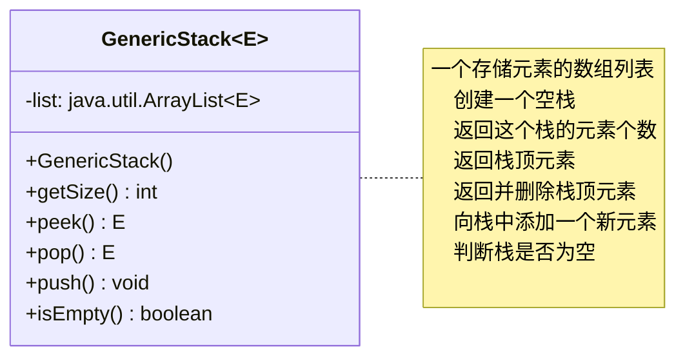

# 一、概述

泛型是指参数化类型的能力，使得代码在编译阶段（而不是运行代码时发现）发现类型不一致的问题，能让问题提前暴露；另外，泛型也让代码的写法更为简洁。

在JDK 1.5引入泛型后，以`java.lang.Comparable`接口的定义及使用为例：

```java
// JDK 1.5引入泛型后
package java.lang;

public interface Comparable<T>{
    public int compareTo(T t);
}
```

其中，`<T>`是形式泛型类型，随后可以用实际具体类型替换它，替换过程称为泛型实例化；另外，未使用泛型的类定义（JDK1.5之前的类）称为 原始类型。

对于使用泛型的优点，用以下代码进行说明：

```java
ArrayList<String> list = new ArrayList<String>();
list.add("Red");
list.add(1); // 由于使用泛型，使得在编译阶段（无需运行代码）就能发现此编译型错误，风险提前暴露，程序将更加可靠

String str = list.get(0); //  由于使用泛型，无需进行类型的强制转换，
// 未使用泛型时，需进行如下转换：
// String str = (String)(list.get(0));
```

泛型可用于定义 类、接口和方法中。

# 二、泛型类的定义

以下是一个示例：



```java
import java.util.ArrayList;

/**泛型栈*/
public class GenericStack<E> {
    private ArrayList<E> list = new ArrayList<E>();
    
    public int getSize(){
        return list.size();
    }

    public E peek(){
        return list.get(getSize() - 1);
    }

    public void push(E e){
        list.add(e);
    }

    public E pop(){
        E e = list.get(getSize() - 1);
        list.remove(getSize() - 1);
        return e;
    }

    public boolean isEmpty(){
        return list.isEmpty();
    }

    @Override
    public String toString() {
        return "GenericStack [list=" + list + "]";
    }
}
```

